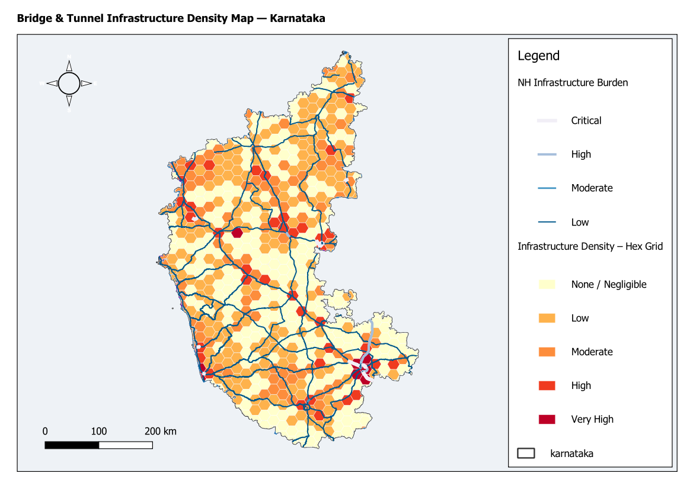

# Bridge & Tunnel Infrastructure Density Map — Karnataka

## Overview
This analysis maps the spatial concentration of engineered road infrastructure
(bridges and tunnels) across Karnataka's major road network. It quantifies
infrastructure density per 20 km hex cell, identifies which National Highway
corridors carry the heaviest bridge and tunnel burden as a proportion of their
total length, and produces a maintenance prioritization reference for Karnataka's
road network.

---

## Input Layers

  Layer                  Type   Features  CRS         Fields Used
  ---------------------  -----  --------  ----------  ---------------------------
  karnataka              Poly   1         EPSG:4326   geometry (boundary)
  karnataka_major_roads  Line   42,475    EPSG:4326   bridge, tunnel, fclass
  national_highways      Line   3,119     EPSG:4326   ref, fclass, length_km

All layers reprojected to EPSG:32643 (WGS 84 / UTM Zone 43N) before processing.

---

## Methodology

### Step 1 — Infrastructure Extraction
Bridge and tunnel segments were extracted from karnataka_major_roads using
expression filters (bridge = 'T' and tunnel = 'T' respectively), then clipped
to the Karnataka boundary. Segment geometry length in metres was computed as
SEG_LEN_M for use in density calculations.

  Bridges extracted : 3,262 segments
  Tunnels extracted :   279 segments

### Step 2 — Hex Grid Density (infra_density_hex.gpkg)
A 20 km hexagonal grid was generated over Karnataka and clipped to the state
boundary (652 cells). Bridge and tunnel segment lengths were summed per cell
using native:joinbylocationsummary (intersects predicate, sum + count).
The following fields were computed per cell:

  BRIDGE_KM    Total bridge length in cell (km)
  TUNNEL_KM    Total tunnel length in cell (km)
  TOTAL_INF_KM Combined engineered infrastructure length (km)
  BRIDGE_DENS  Bridge density (km/km²)
  TUNNEL_DENS  Tunnel density (km/km²)
  TOTAL_DENS   Combined infrastructure density (km/km²)

Density thresholds calibrated to observed distribution
(non-zero range: 0.00041 – 0.159 km/km²):

  Class      TOTAL_DENS threshold   Cells
  ---------  ---------------------- -----
  Very High  >= 0.006               47
  High       0.002 – 0.006          96
  Moderate   0.0005 – 0.002         199
  Low        > 0 – 0.0005           145
  None       0.0                    165

### Step 3 — NH Corridor Infrastructure Burden (nh_infra_burden.gpkg)
National highway segments were dissolved by ref (83 corridors) and total NH
length computed from geometry (NH_KM). Bridge and tunnel lengths intersecting
each corridor were summed separately, then combined into INFRA_KM. The burden
ratio was computed as:

  INFRA_PCT = (INFRA_KM / NH_KM) × 100

Corridors classified by BURDEN_CLS:

  Class     INFRA_PCT threshold
  --------  -------------------
  Critical  >= 20%
  High      10 – 19.9%
  Moderate  5 – 9.9%
  Low       < 5%

Top burdened corridors (NH_KM > 10 km):
  NH44:    239.5 km total, 45.2 km infra, 18.9% burden
  NH48;75: 17.6 km total,   7.6 km infra, 43.2% burden
  NH44;48: 43.1 km total,  16.6 km infra, 38.5% burden

---

## Output Files

  File                                  Description
  ------------------------------------  -----------------------------------------
  bridge_segments.gpkg                  3,262 bridge segments with SEG_LEN_M
  tunnel_segments.gpkg                  279 tunnel segments with SEG_LEN_M
  infra_density_hex.gpkg                652 hex cells with density fields + INFRA_CLS
  nh_infra_burden.gpkg                  83 NH corridors with burden fields + BURDEN_CLS
  Bridge_Tunnel_Infrastructure_Density.qgz  QGIS project with symbology
  README.md                             This file

---

## Symbology

  Layer                        Style
  ---------------------------  -------------------------------------------------
  Bridge Segments              Blue line (#2171b5), width 0.8
  Tunnel Segments              Purple line (#6a0dad), width 0.8
  Infrastructure Density Hex   YlOrRd graduated on TOTAL_DENS (5 classes)
  NH Infrastructure Burden     Categorized on BURDEN_CLS: Dark Red > Tan
  Karnataka                    Transparent fill, dark grey outline (#333333)

---

## Limitations
- NH corridor burden is computed using spatial intersection, not snapped network
  matching. Some bridge/tunnel segments from karnataka_major_roads may overlap
  NH corridors from national_highways without being the same OSM feature.
- NH ref field contains inconsistent tagging (e.g. 'NH44;48', 'NH44;48;75')
  resulting in some very short dissolved corridors with inflated INFRA_PCT.
  Filter to NH_KM > 10 for reliable burden comparisons.
- Density is length-based, not weighted by structure type or age.

---
Analysis date : May 2026
CRS           : EPSG:32643 (WGS 84 / UTM Zone 43N)
Data source   : OpenStreetMap via Karnataka GIS dataset

---

## Map Preview

